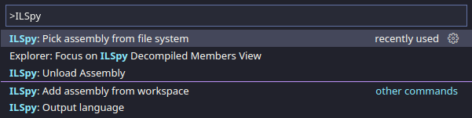

# The Grinch

> Who stole the Christmas? Try and guess.
Author : edmund  

## Première 
The file extension ```.exe``` may indicate Microsoft Windows as the operative
system target. The ```file``` utility confirms this :
``` bash
$ file grinch.exe 
grinch.exe: PE32 executable (GUI) Intel 80386 Mono/.Net assembly, for MS Window 
```

I do not have any Microsoft Windows analysis machine ready at the moment.
Let's do it all statically !

## Ghidra
Ghidra decompiles the application to an impressive, hard to read - and understand - output :  


Ghidra identified several functions, some of them refer to GUI actions :  


- ```button1_Click-310-8324```
- ```Form1_Load-310-8286```

This might help us to identify some of the technologies used to create the binary.

## Identifying the .NET framework
A simple ```strings``` against ```grinch.exe``` gives us some important pieces of information :
```
$ strings grinch.exe | less
    ...
Copyright 
  2021
$68999d03-9ec6-4459-a201-57e1085d1000
1.0.0.0
.NETFramework,Version=v4.7.2
FrameworkDisplayName
.NET Framework 4.7.2
3System.Resources.Tools.StronglyTypedResourceBuilder
4.0.0.0
KMicrosoft.VisualStudio.Editors.SettingsDesigner.SettingsSingleFileGenerator
11.0.0.0
    ...
```

The ```.NET``` was used to build the file. 

## Reversing .NET based applications
The ```.NET Framework``` use the Common Language Infrastructure (CIL) to produce
machine independant code which is run by the Common Language Runtime (CLR). Kind
of Java bytecode and the JVM.

There are several options to interpret the CIL to a human readable code. I decided
to use the [```ILSpy```](https://github.com/icsharpcode/ILSpy) way.
It is available directly into ```Visual Studio Code``` so easy to install and use.

## Decompiling with Visual Studio Code and ILSpy
Installation guidelines are available on the project repository main page. The
easiest way is through the official extension market place.

### Importing the binary file
- Open the ```Command Pallette``` : ```View``` > ```Command Pallette``` or ```Ctrl+Shift+P```
- Type ```ILSpy```
- Select ```ILSpy : Pick assembly from file system```
- Select the ```grinch.exe``` file  



ILSpy creates a new panel : ```ILSPY DECOMPILED MEMBERS``` which contains the decompiled code.  


## Finding validation algorithm
No need to understand every parts of the application to find the flag. Let's try
to focus only on the validation algorigthm. The presence of methods named ```Form_load``` and ```InitializeComponent``` along with ```Checkbox``` attributes in the ```Form1``` file indicates that the input might be passed through a graphical GUI :

```C#
    ...
		private IContainer components;
		private CheckBox checkBox1;
		private CheckBox checkBox2;
            ...
		private CheckBox checkBox8;
		private Button button1;
    ...
        private void InitializeComponent()
            ...
            button1 = new Button();
            ((Control)this).SuspendLayout();
            ((Control)checkBox1).set_AutoSize(true);
            ((Control)checkBox1).set_Location(new Point(602, 21));
            ...
            ((ButtonBase)button1).set_UseVisualStyleBackColor(true);
			((Control)button1).add_Click((EventHandler)button1_Click);
			((ContainerControl)this).set_AutoScaleDimensions(new SizeF(6f, 13f));
			((ContainerControl)this).set_AutoScaleMode((AutoScaleMode)1);
			((Control)this).set_BackgroundImage((Image)componentResourceManager.GetObject("$this.BackgroundImage"));
            ...
    ...
```

Key points from these lines :
- the GUI handles several ```CheckBox``` (8)
- there is only one ```Button``` (```button1```)
- the ```button1```'s callback function is ```button1_Click```

```button1_Click()``` might contain the validation algorithm.

## button1_Click() sources

```C#
private void button1_Click(object sender, EventArgs e)
{
    //IL_0145: Unknown result type (might be due to invalid IL or missing references)
    //IL_015e: Unknown result type (might be due to invalid IL or missing references)
    CheckBox[] array = (CheckBox[])(object)new CheckBox[8] { checkBox1, checkBox2, checkBox3, checkBox4, checkBox5, checkBox6, checkBox7, checkBox8 };
    int[] array2 = new int[4] { 154, 43, 63, 200 };
    int num = 0;
    for (int i = 0; i < array.Length; i++)
    {
        num += Convert.ToByte(Convert.ToInt16(array[i].get_Checked()) << i);
    }
    if (array2[level] == num)
    {
        num = 0;
        for (int j = 0; j < 8; j++)
        {
            num += Convert.ToByte(Convert.ToInt16(array[j].get_Checked())) * 3 << j;
        }
        byte b = Convert.ToByte(num % 256);
        Form1.k[level] = b;
        level++;
        if (level == 4)
        {
            for (int k = 0; k < what.Length; k++)
            {
                what[k] ^= Form1.k[k % 4];
            }
            
            level = 0;
        }
        reset_checks(array);
    }
    else
    {
        MessageBox.Show("Try again!");
        level = 0;
    }
}
```

Key points from these lines :
- there are two ```MessageBox``` that print interesting sentences :
    * failure : ```MessageBox.Show("Try again!");```
    * success : ```MessageBox.Show("Make up your mind already\n" + Encoding.Default.GetString(what));```
- the ```what``` variable is produced from a simple ```XOR``` loop : ```what[k] ^= Form1.k[k % 4];```
- ```Form1.k[]``` values seem to be dynamic

The key (```Form1.k```) is not directly accessible. But it is easy to guess it.
All of the flags start with the same syntax : ```X-MAS{xxxx}```

This allows a plaintext attack.

## Guessing the key
The secret is stocked in the ```Form1.what``` attribute : 
```C#
public static byte[] what = new byte[25] {
    150, 172, 240, 25, 157, 250, 202, 61, 162, 237,
    147, 118, 224, 175, 202, 48, 161, 222, 212, 43,
    145, 232, 201, 103, 179
};
```

The key is 4 letters long so the first 4 letters from the known plaintext is needed :
```
X-MA
```

A char to char XOR operation gives out the key :
```python
key[0] = ord('X') ^ 150 # = 206
key[1] = ord('-') ^ 172 # = 129
key[2] = ord('M') ^ 240 # = 189
key[3] = ord('A') ^  25 # =  88
```

A simple loop over ```Form1.what``` reveals the flag :
```python
for idx, value in enumerate(what) :
    secret += chr(value ^ k[idx%4])
```

## Script example
```python
#! /usr/bin/env python3

# Form1.what <> secret
secret = [150, 172, 240, 25, 157, 250, 202, 61, 162, 237, 147, 118, 224, 175, 202, 48, 161, 222, 212, 43, 145, 232, 201, 103, 179]

# Known plain text
knownText = "X-MA"

# Compute the key from the known text
# Form1.k <> key
key = []
for idx, char in enumerate(knownText) :
    key.append(ord(char) ^ secret[idx])

# Reveal the secret
output = ""
for idx, value in enumerate(secret) :
    output += chr(value ^ key[idx % 4])
print("Flag : {}".format(output))
```
```
python3 solution.py
Flag : X-MAS{well....who_is_it?}
```
